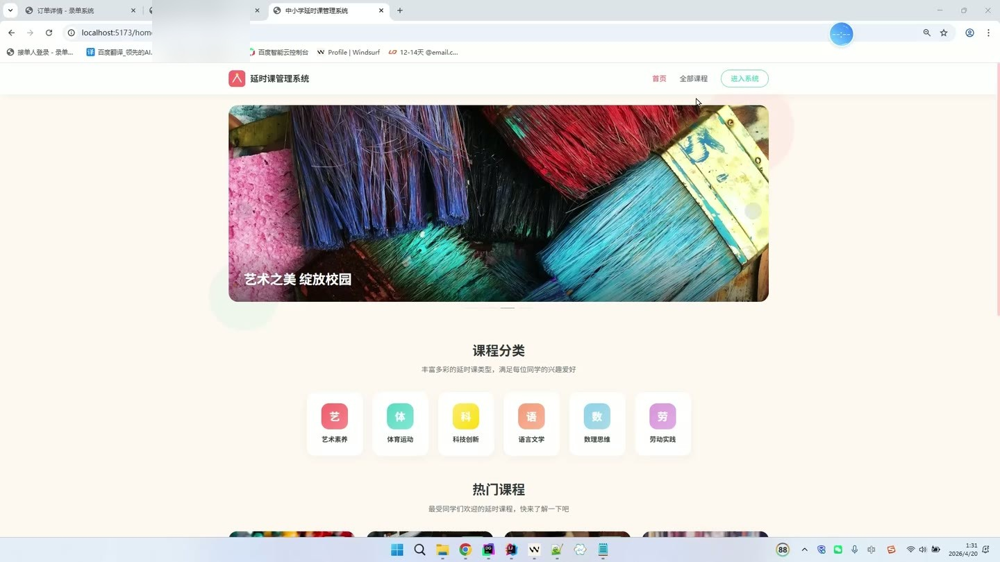
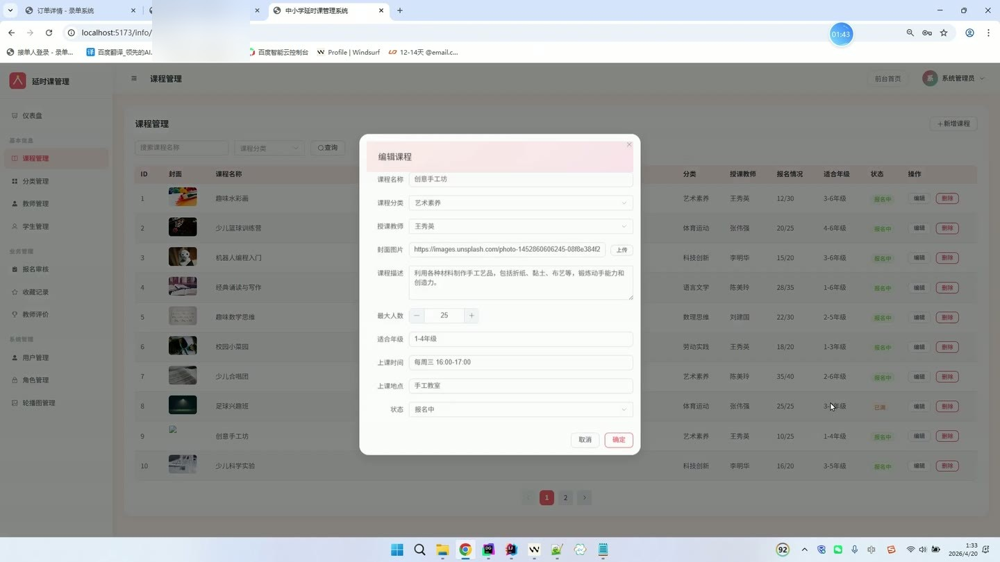
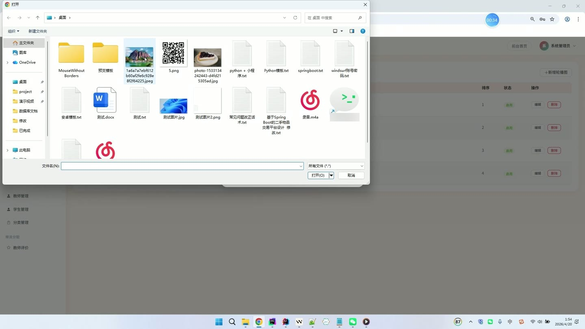
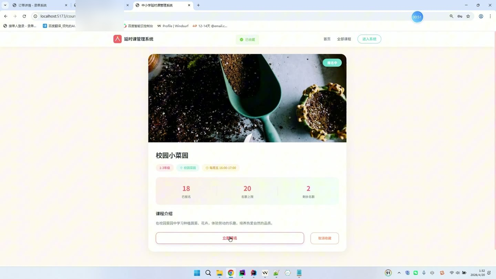
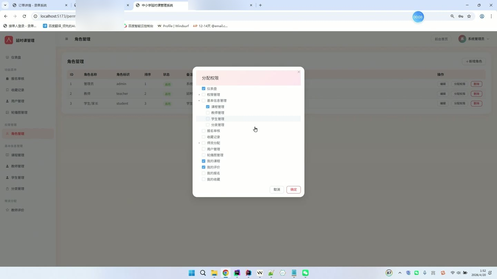

# (附文档)Springboot3+Vue3+MySQL 中小学课后时延系统

**技术栈**：Springboot3、Vue3、MySQL

### 系统简介

本系统是一套基于 Spring Boot 3 + Vue 3 + MySQL 的中小学课后延时服务管理平台，采用前后端分离架构。系统包含管理员、教师、学生/家长三种角色，提供课程管理、报名审核、教师评价、收藏管理、轮播图配置、角色权限分配等完整功能，满足学校课后延时课程的全流程数字化管理需求。
 
### 核心功能
 
### 普通用户端

 
- 查看公开轮播图列表（仅显示启用状态，按排序字段升序排列） 
- 浏览课程分类列表（仅显示启用状态，按排序字段升序排列） 
- 分页查看公开课程列表（支持按课程标题模糊搜索、按分类筛选） 
- 查看课程详情（获取课程标题、封面、描述、教师、最大人数、当前人数、年级范围、上课时间、地点、状态） 
- 用户注册（填写用户名、密码、姓名等信息，注册后状态为待审核，默认角色为学生） 
- 用户登录（输入用户名和密码，校验账号状态，生成 JWT Token，返回用户信息、角色、权限列表、菜单树） 
- 获取当前登录用户信息（通过 Authorization 请求头解析 Token，返回用户详情、权限标识、菜单列表） 
- 报名课程（选择课程提交报名，自动设置报名状态为待审核，校验是否已报名及课程人数是否已满） 
- 收藏/取消收藏课程（点击切换收藏状态，前端实时反馈已收藏或已取消） 
- 查看我的报名记录（分页展示本人报名列表，包含课程名称、报名状态、审核时间） 
- 查看我的收藏列表（分页展示本人收藏的课程，包含课程标题、封面） 
- 对授课教师进行评价（选择教师和课程，填写评分和评价内容） 
- 查看个人资料（展示用户基本信息，包括用户名、真实姓名、手机号、头像、角色） 
- 修改个人资料（更新真实姓名、手机号、头像等字段）
 
### 管理员端

 
- 仪表盘统计概览（展示教师总数、学生总数、课程总数、待审核报名数、已通过报名数、收藏总数） 
- 课程管理（分页查询课程列表，支持按标题、分类、状态、教师筛选；新增/编辑课程，设置标题、分类、教师、封面、描述、最大人数、年级范围、上课时间、地点、状态） 
- 课程分类管理（新增/编辑分类名称、排序、启用状态；删除分类） 
- 教师管理（分页查询教师列表，支持按关键词、角色、状态筛选；新增/编辑教师账号，重置密码为 123456，启用/禁用账号） 
- 学生管理（分页查询学生列表，支持按关键词、角色、状态筛选；新增/编辑学生账号，重置密码，启用/禁用/审核账号） 
- 报名审核（分页查看所有报名记录，支持按状态、学生、课程筛选；审核通过或驳回报名，通过后自动更新课程当前人数，若人数满则自动将课程状态设为已满） 
- 收藏记录查看（分页查看所有课程的收藏记录，支持按用户筛选） 
- 教师评价管理（分页查看所有评价记录，支持按教师筛选；删除评价） 
- 轮播图管理（新增/编辑轮播图，设置标题、图片 URL、跳转链接、排序、启用状态；删除轮播图） 
- 角色管理（新增/编辑角色名称、角色标识、排序、状态；删除角色；为角色分配菜单/权限） 
- 权限管理（以树形结构展示所有权限菜单，支持新增/编辑权限名称、权限标识、父级、类型、路径、图标、排序） 
- 用户管理（分页查询所有用户，支持按关键词、角色、状态筛选；新增/编辑用户，重置密码，启用/禁用账号） 
- 文件上传（上传图片文件，返回可访问的 URL 地址，用于课程封面、轮播图等）
 
### 教练端

 
- 查看我的课程列表（分页展示当前教师负责的课程，包含课程名称、分类、报名人数、状态） 
- 查看我的评价记录（分页展示其他用户对当前教师的评价，包含评分、评价内容、评价人、对应课程） 
- 仪表盘快捷入口（我的课程、我的评价、前台首页）
 
### 技术栈

  后端框架 Spring Boot 3.0   ORM MyBatis-Plus 3.5   权限认证 Spring Security + JWT   前端框架 Vue 3 (Composition API)   状态管理 Pinia   路由 Vue Router 4 (History 模式)   UI 组件库 Element Plus   构建工具 Vite   数据库 MySQL 8.0   文件上传 MultipartFile 本地存储 
 
### 交付内容

 
- 后端完整源码 
- 前端完整源码 
- 数据库初始化脚本 
- 万字文档

## 界面展示

---

## 获取完整源码 + 万字文档

本仓库为项目介绍页。**完整前后端源码、数据库初始化脚本、万字项目文档**，请加微信 `kangkangcode`，或访问 [codekk.top](http://codekk.top) 获取。

可作课程设计 / 毕业设计参考，支持远程部署调试。